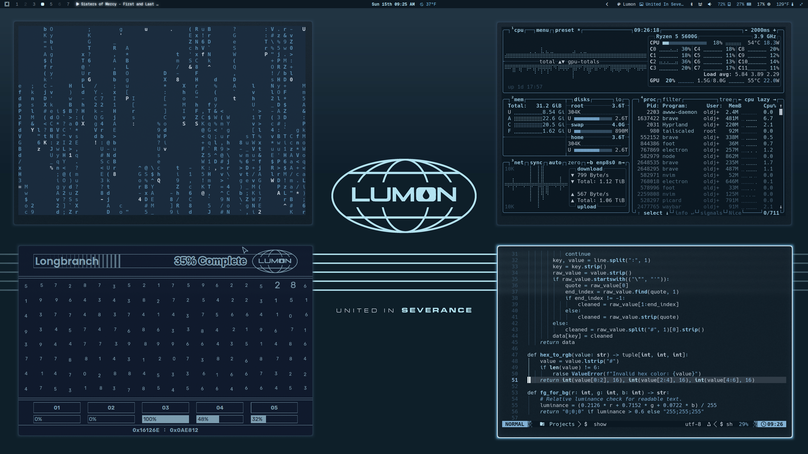

# Omarchy Lumon Theme

A cold corporate Omarchy theme inspired by Lumon Industries and the terminal palettes of *Severance*: navy voids, fluorescent cyan edges, sterile blue-gray surfaces, and enough institutional calm to make every workflow feel faintly supervised.

## Preview



## Install

Per approved Lumon onboarding procedure, install the theme from GitHub:

```bash
omarchy-theme-install https://github.com/OldJobobo/omarchy-lumon-theme
```

Upon successful installation, your workstation may begin exhibiting improved orderliness, emotional partitioning, and respect for clean geometric borders.

## Orientation

Welcome, refiner.

The Lumon Theme is designed to transform a standard Omarchy workstation into a compliant Macrodata Refinement environment. This package includes coordinated terminal palettes, desktop surfaces, lockscreen styling, notifications, and wallpaper assets aligned with approved Lumon visual doctrine.

Please enjoy each color equally.

## What's Included

- Hyprland presentation and border tuning (`hyprland.conf`)
- Hyprlock styling (`hyprlock.conf`)
- Terminal palettes for Alacritty, Kitty, Ghostty, Foot, and Warp
- UI surfaces for GTK, Walker, mako, and SwayOSD
- Supporting app themes for btop, Neovim, Vencord, and Aether/Zed
- The local Lumon launcher entry (`Lumon Macrodata Refiner.desktop`)
- Wallpaper set sourced for a unified Lumon workplace atmosphere

## Macrodata Refinement Access

For approved employees, the local launcher is:

`Lumon Macrodata Refiner.desktop`

Standard deployment path after running the bundled installer:

```text
~/.local/share/applications/Lumon Macrodata Refiner.desktop
```

To install the bundled launcher and icon:

```bash
cd ~/.config/omarchy/themes/lumon && ./install-lumon-launcher.sh
```

To remove the bundled launcher and icon:

```bash
cd ~/.config/omarchy/themes/lumon && ./uninstall-lumon-launcher.sh
```

The installer copies the bundled desktop entry and Hyprland icon into Omarchy's standard local applications paths:

```text
~/.local/share/applications/Lumon Macrodata Refiner.desktop
~/.local/share/applications/icons/Lumon Macrodata Refiner.png
```

The uninstall script removes those installed launcher files from the selected applications directory.

The launcher then opens the Lumon Macrodata Refiner web application through `omarchy-launch-webapp`, allowing refiners to begin their assigned duties in a properly sanctioned browser shell.

Omarchy theme installation does not currently run theme post-install hooks automatically, so the launcher installer must be run manually once after theme installation.

If your workstation has received the launcher, open your application launcher and search for:

`Lumon Macrodata Refiner`

Employees are advised not to speculate on the meaning of the numbers.

## Wallpapers

<table>
  <tr>
    <td></td>
    <td></td>
    <td></td>
  </tr>
</table>

## Requirements

- A Hyprland-based Omarchy setup
- A terminal with support for theme import
- `gum` for the interactive launcher install and uninstall scripts
- A healthy respect for fluorescent blue-white contrast
- Optional: run `install-lumon-launcher.sh` to install the bundled launcher for full workplace immersion

## Wellness Notes

- This README is not an official Lumon Industries publication.
- The theme itself is real.
- Your outie approved this installation.

## Attribution

- Inspired by the visual language of *Severance*
- Omarchy theme structure and install flow by the Omarchy theme ecosystem
